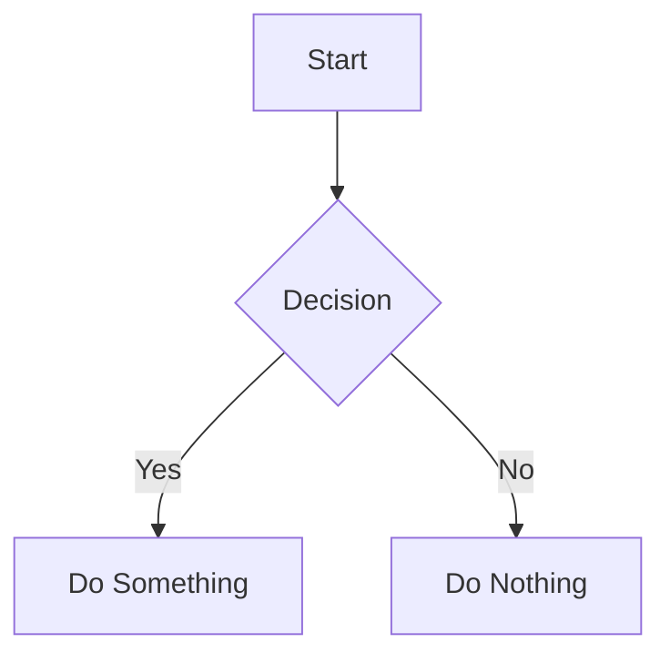

# Mermaid Diagram Cheatsheet

A comprehensive guide to creating diagrams with Mermaid. This cheatsheet includes examples and common patterns for different types of diagrams.

## Categories

- [Flowcharts](./flowchart.md) - Visualize workflows and processes
- [Sequence Diagrams](./sequence.md) - Show interactions between components
- [Class Diagrams](./class.md) - Represent object-oriented structures
- [Entity Relationship Diagrams](./er.md) - Database and data structure relationships
- [State Diagrams](./state.md) - Illustrate state machines and transitions
- [Gantt Charts](./gantt.md) - Project timelines and scheduling
- [Pie Charts](./pie.md) - Simple statistical visualization
- [Git Graph](./git.md) - Visualize git workflows

## Getting Started

To use Mermaid in your markdown files:

## Resources

- [Official Mermaid Documentation](https://mermaid.js.org/intro/)
- [Mermaid Live Editor](https://mermaid.live/)

