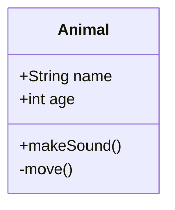
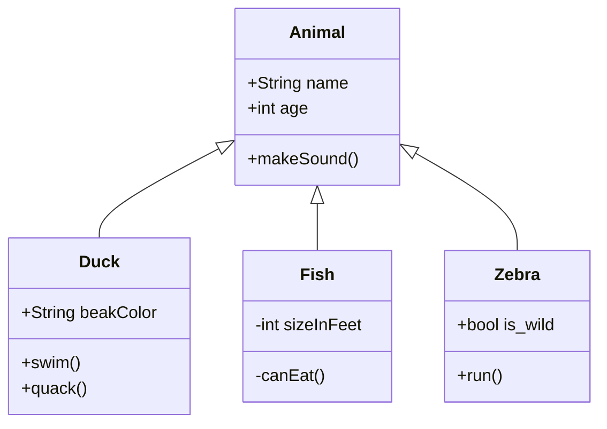
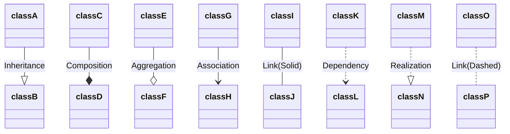
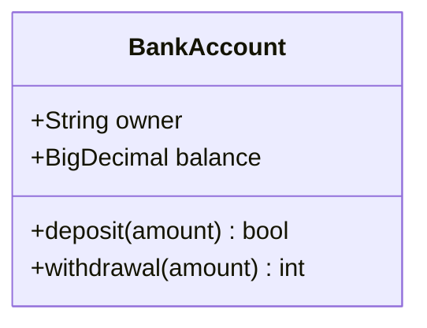

# Class Diagrams

Class diagrams show the structure of object-oriented systems.

## Basic Class

```mermaid
classDiagram
    class Animal {
        +String name
        +int age
        +makeSound()
        -move()
    }
```

## Relationships

```mermaid
classDiagram
    Animal <|-- Duck
    Animal <|-- Fish
    Animal <|-- Zebra
    Animal : +String name
    Animal : +int age
    Animal: +makeSound()
    class Duck{
        +String beakColor
        +swim()
        +quack()
    }
    class Fish{
        -int sizeInFeet
        -canEat()
    }
    class Zebra{
        +bool is_wild
        +run()
    }
```

## Relationship Types

```mermaid
classDiagram
    classA --|> classB : Inheritance
    classC --* classD : Composition
    classE --o classF : Aggregation
    classG --> classH : Association
    classI -- classJ : Link(Solid)
    classK ..> classL : Dependency
    classM ..|> classN : Realization
    classO .. classP : Link(Dashed)
```

## Methods and Types

```mermaid
classDiagram
    class BankAccount{
        +String owner
        +BigDecimal balance
        +deposit(amount) bool
        +withdrawal(amount) int
    }
```

