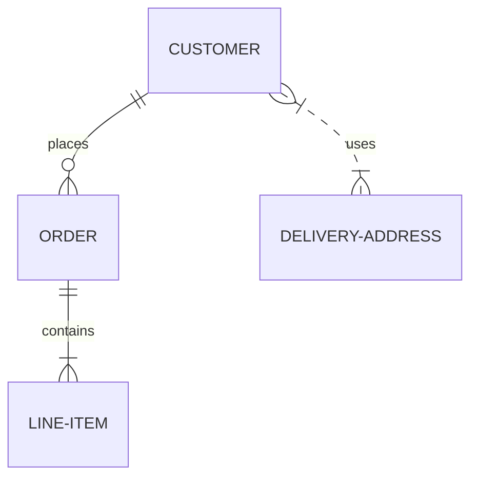
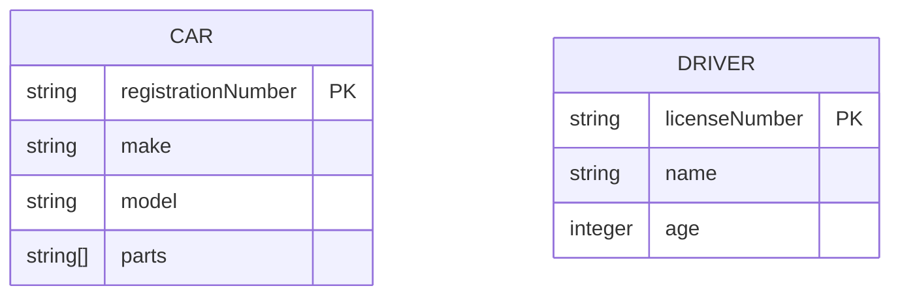

# Entity Relationship Diagrams

ER diagrams show the relationships between entities in a database.

## Basic Syntax



## Relationship Types

```mermaid
erDiagram
    CUSTOMER ||--o{ ORDER : "one-to-many"
    STUDENT }|--|{ CLASS : "many-to-many"
    DRIVER ||--|| CAR : "one-to-one"
```

## Attributes



## Cardinality and Key Types

- `|o` - Zero or one
- `||` - Exactly one
- `}o` - Zero or many
- `}|` - One or many

