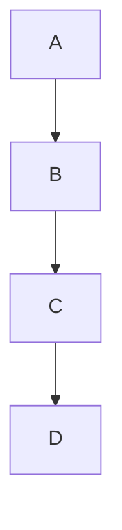
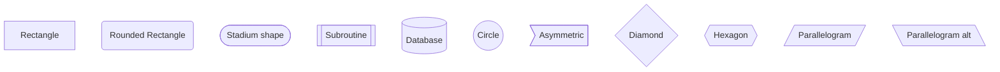
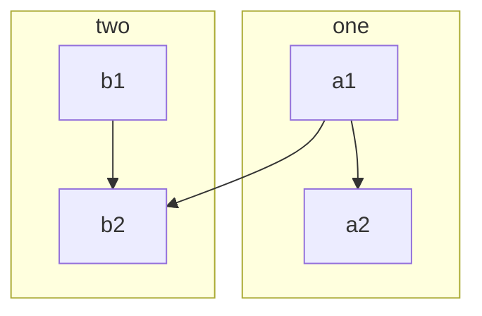
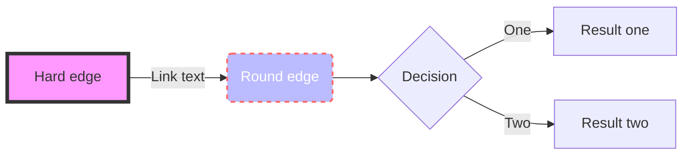

# Flowchart Guide

Flowcharts are used to represent workflows, processes, and decision trees.

## Basic Syntax



## Node Shapes



## Arrow Types

```mermaid
graph LR
    A --> B    %% Basic arrow
    C ==> D    %% Thick arrow
    E -.-> F   %% Dotted arrow
    G ==> H    %% Thick arrow
    I --- J    %% Line without arrow
    K o--o L   %% Circle connections
    M x--x N   %% Cross connections
```

## Subgraphs



## Direction

- TB - top to bottom
- TD - top-down (same as TB)
- BT - bottom to top
- RL - right to left
- LR - left to right

## Styling



