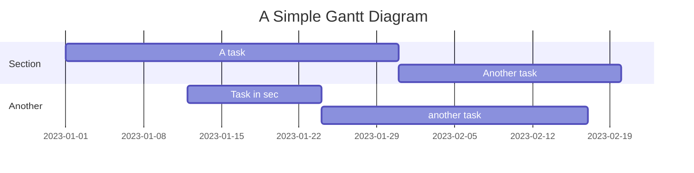
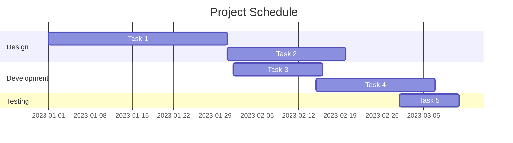
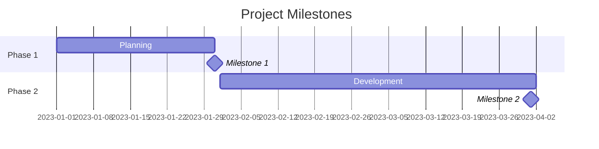

# Gantt Charts

Gantt charts show project schedules with tasks and their durations.

## Basic Syntax

```mermaid
gantt
    title A Simple Gantt Diagram
    dateFormat  YYYY-MM-DD
    section Section
    A task           :a1, 2023-01-01, 30d
    Another task     :after a1, 20d
    section Another
    Task in sec      :2023-01-12, 12d
    another task     :24d
```

## Sections and Tasks

```mermaid
gantt
    dateFormat  YYYY-MM-DD
    title Project Schedule
    
    section Design
    Task 1           :a1, 2023-01-01, 30d
    Task 2           :after a1, 20d
    
    section Development
    Task 3           :2023-02-01, 15d
    Task 4           :2023-02-15, 20d
    
    section Testing
    Task 5           :2023-03-01, 10d
```

## Milestones

```mermaid
gantt
    dateFormat  YYYY-MM-DD
    title Project Milestones
    
    section Phase 1
    Planning        :a1, 2023-01-01, 30d
    Milestone 1     :milestone, after a1, 0d
    
    section Phase 2
    Development     :2023-02-01, 60d
    Milestone 2     :milestone, 2023-04-01, 0d
```

