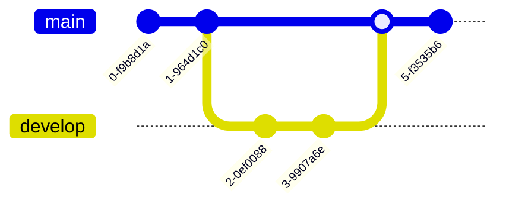
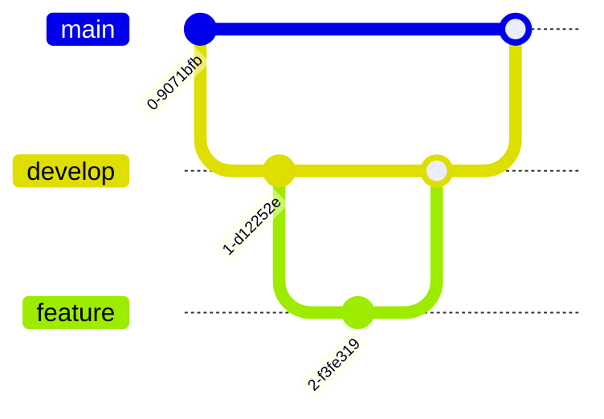
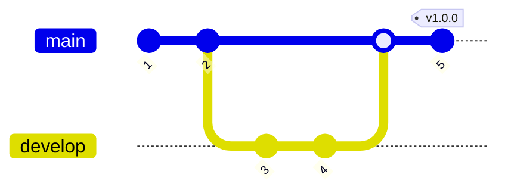

# Git Graphs

Git graphs show branching and merging in version control.

## Basic Branch and Merge

```mermaid
gitGraph
    commit
    commit
    branch develop
    checkout develop
    commit
    commit
    checkout main
    merge develop
    commit
```

## Multiple Branches

```mermaid
gitGraph
    commit
    branch develop
    checkout develop
    commit
    branch feature
    checkout feature
    commit
    checkout develop
    merge feature
    checkout main
    merge develop
```

## Tagged Commits

```mermaid
gitGraph
    commit id: "1"
    commit id: "2"
    branch develop
    checkout develop
    commit id: "3"
    commit id: "4"
    checkout main
    merge develop
    commit id: "5" tag: "v1.0.0"
```

