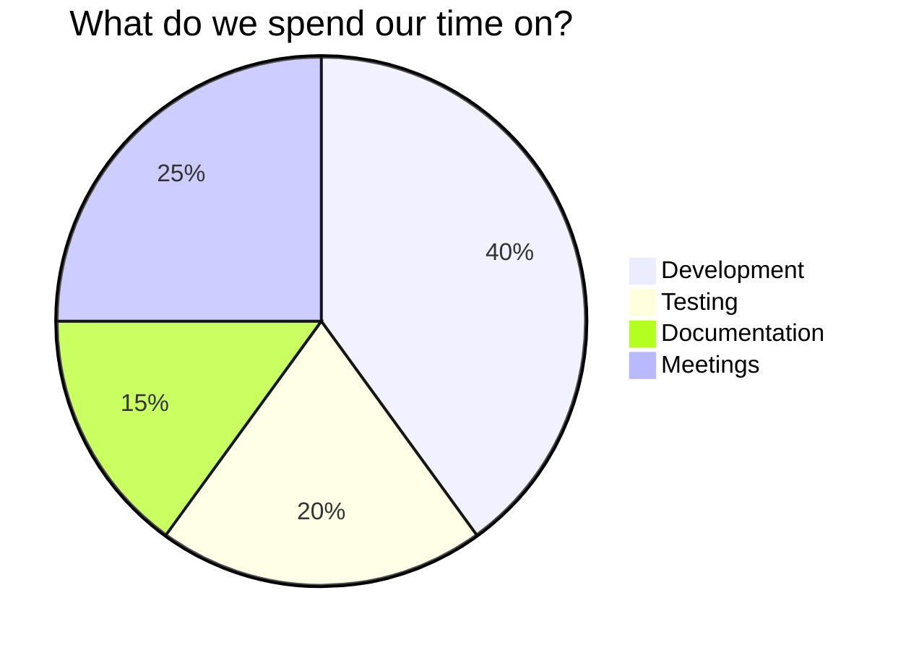
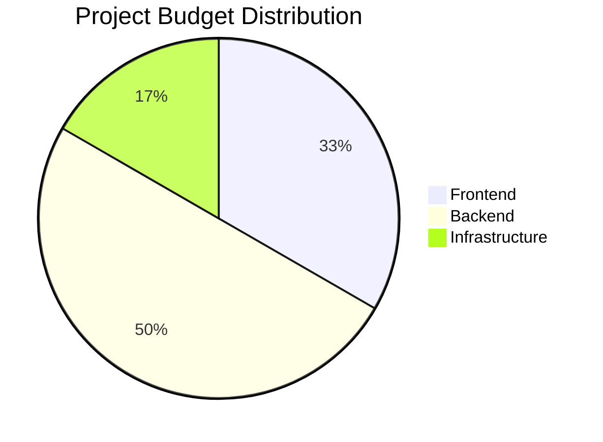
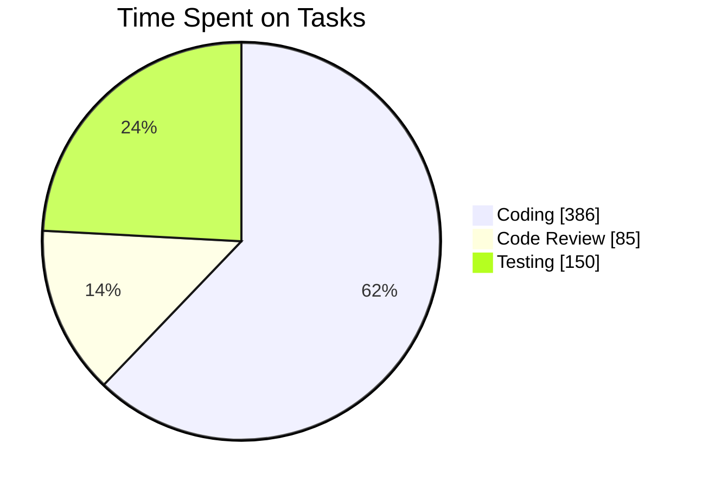

# Pie Charts

Pie charts show the numerical proportion of different categories.

## Basic Syntax

```mermaid
pie
    title What do we spend our time on?
    "Development" : 40
    "Testing" : 20
    "Documentation" : 15
    "Meetings" : 25
```

## With Values

```mermaid
pie
    title Project Budget Distribution
    "Frontend" : 100000
    "Backend" : 150000
    "Infrastructure" : 50000
```

## Styling

```mermaid
pie showData
    title Time Spent on Tasks
    "Coding" : 386
    "Code Review" : 85
    "Testing" : 150
```

