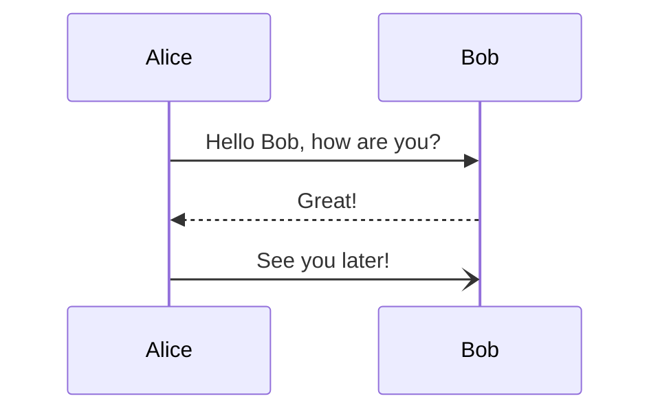
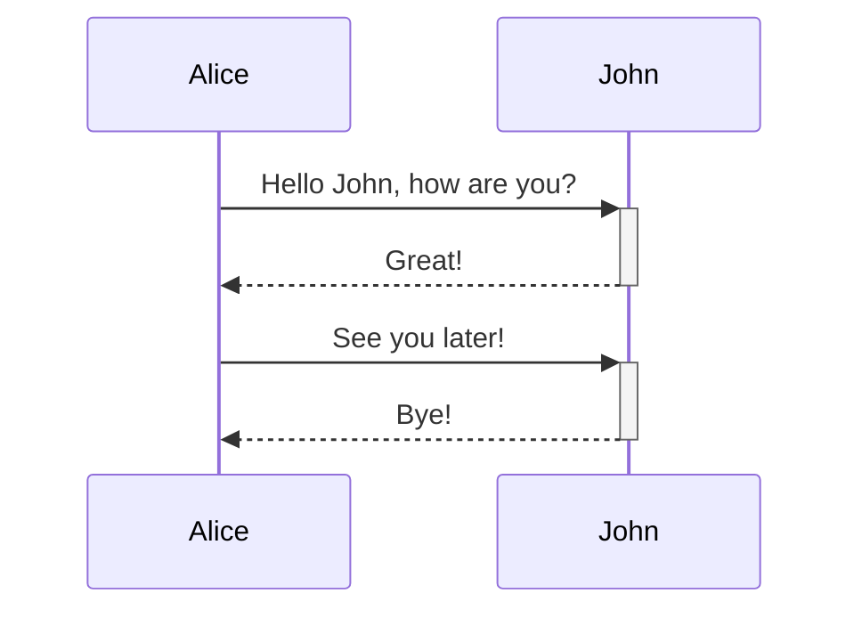
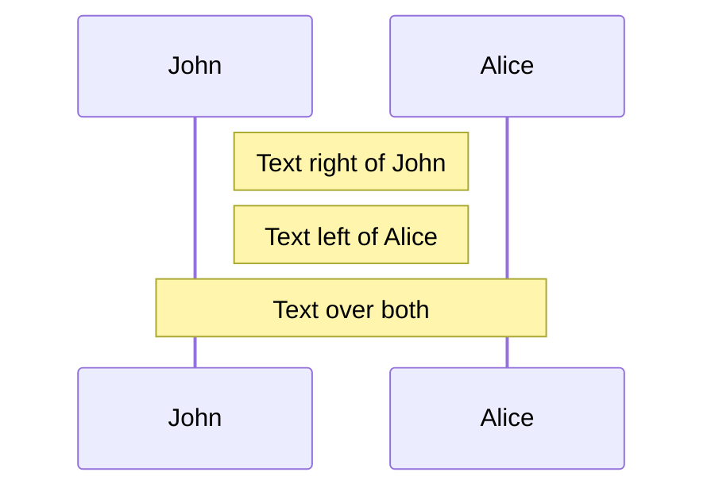
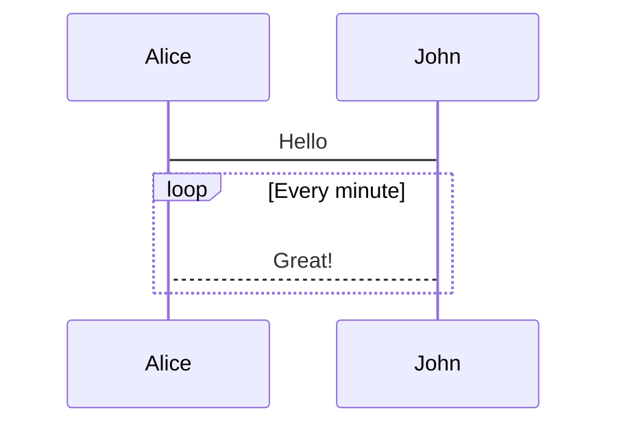
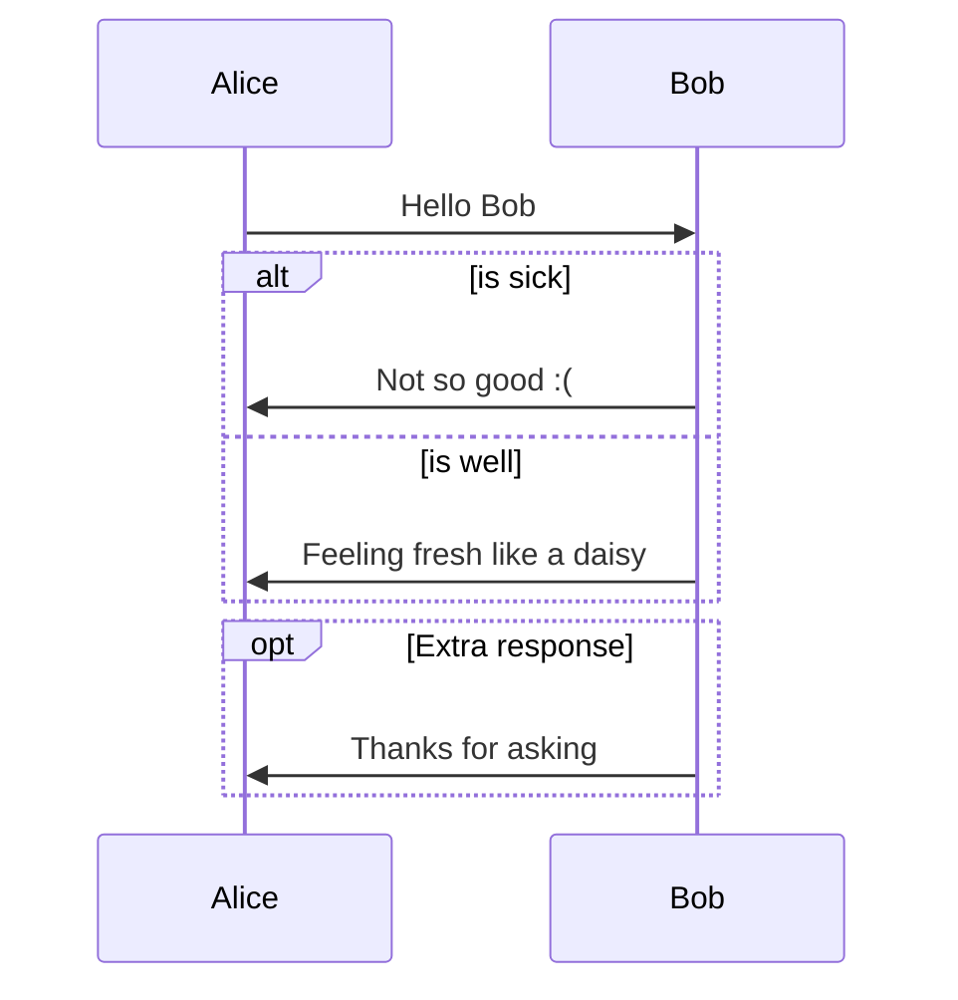

# Sequence Diagrams

Sequence diagrams show how processes operate with one another and in what order.

## Basic Syntax



## Arrow Types

```mermaid
sequenceDiagram
    A->>B: Solid line with arrow
    B-->>A: Dashed line with arrow
    A--->B: Solid line with open arrow
    B---->A: Dashed line with open arrow
    A-)B: Solid line with cross
    B--)A: Dashed line with cross
```

## Activations



## Notes



## Loops



## Alt and Opt



