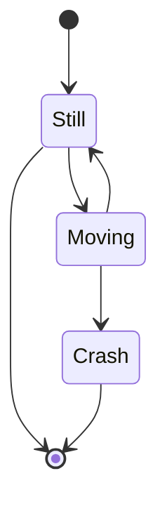
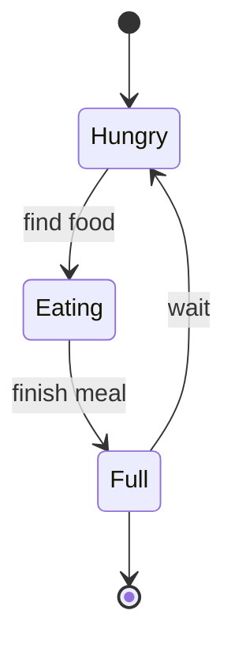
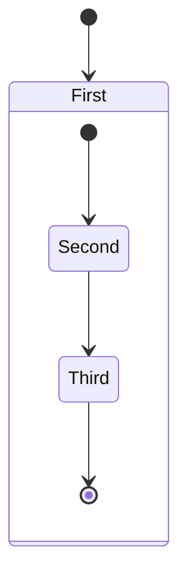
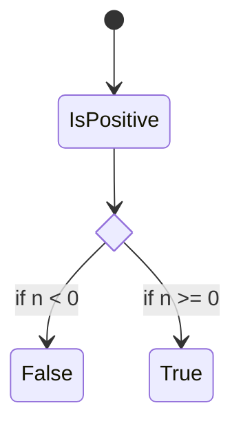

# State Diagrams

State diagrams describe the different states of a system and the transitions between them.

## Basic Syntax

```mermaid
stateDiagram-v2
    [*] --> Still
    Still --> [*]
    Still --> Moving
    Moving --> Still
    Moving --> Crash
    Crash --> [*]
```

## State Descriptions

```mermaid
stateDiagram-v2
    state "Hungry" as hungry
    state "Eating" as eating
    state "Full" as full
    
    [*] --> hungry
    hungry --> eating : find food
    eating --> full : finish meal
    full --> hungry : wait
    full --> [*]
```

## Composite States

```mermaid
stateDiagram-v2
    [*] --> First
    state First {
        [*] --> Second
        Second --> Third
        Third --> [*]
    }
```

## Choice

```mermaid
stateDiagram-v2
    state if_state <<choice>>
    [*] --> IsPositive
    IsPositive --> if_state
    if_state --> False: if n < 0
    if_state --> True : if n >= 0
```

